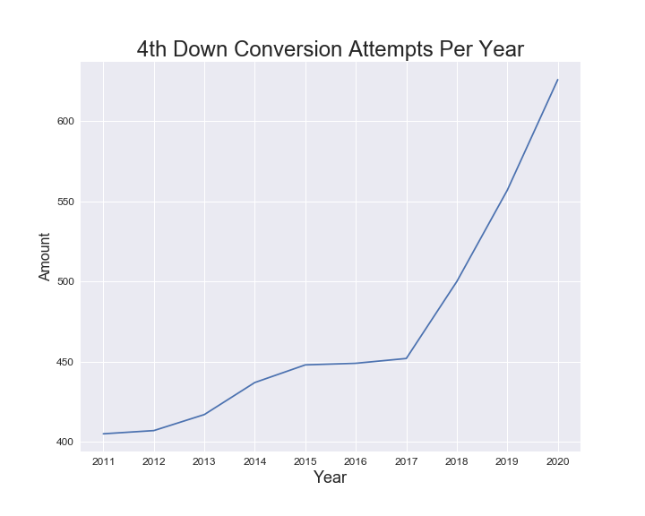
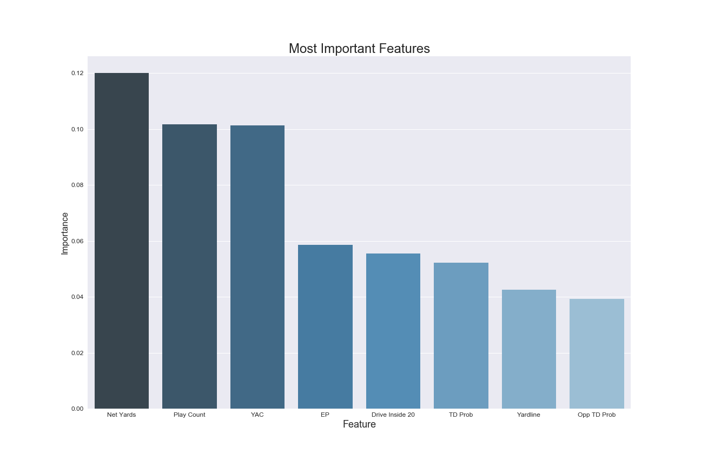
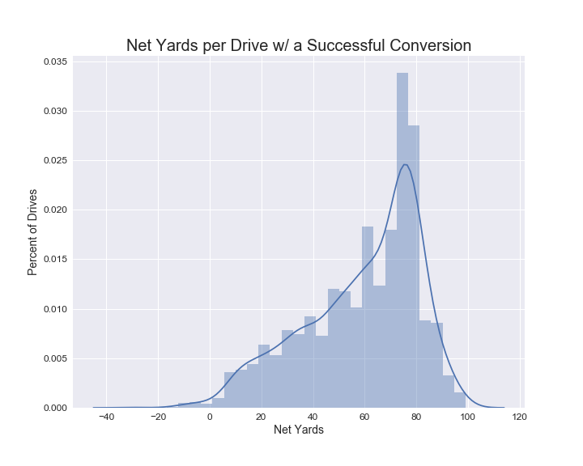
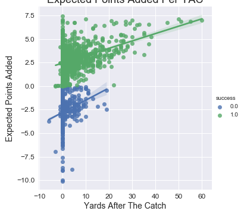

# NFL 4th Down Classification

**Author**: Dave Brown

## Problem

Business Problem: To create a machine learning algorithm that can predict the likelihood of a success or failure on a 4th down conversation attempt.

Steps:
1. Explore the data to get familiar with it
2. Clean the data and drop any unnecessary columns
3. Feature engineer offensive and defensive rankings for the teams involved in each conversion attempt
4. Transform the categorical data so it can be used in the models
5. Run the models
6. Find the best fit

## Methodology

Using the nflfastR data, I created a dataset that contained every play from 2011 to 2020. For this classification issue, I will only be focusing on regular season 4th down attempts where the offense is on the field. 4th down attempts have been increasing each season so it is important that teams are going for it in the correct situations.

After dropping columns that were not relevant to the issue and taking care of null values, two new columns were feature engineered. Using the Football Database, every team assigned their offensive and defensive rank for each season. This was done to better balance the data. If many top offenses were succeeding against poor defenses on conversion attempts, the final model would not reflect the entire league. Once the feature engineering was completed, the remaining categorical data was dummied so it could be included in the models.

## Results

In this classification issue, precision represents the conversion attempts that appear to have succeeded, but actually failed. Recall represents the attempts that appear to have failed, but acutally succeeded. Because a turnover is worse than a punt or field goal, precision is the more important measurement.

### Random Forest

The Random Forest turned out to be the best Classifier for this dataset. The initial model's accuracy, precision and recall performed well. Each metric had over 82% efficency.

Each feature had an importance higher than zero so there was no need to drop any. Next, I used GridSearchCV to improve the model. This resulted in the accuracy improving from 83.05% to 83.26%, the precision increasing from 83.57% to 88.16%.

As you can see above, these are the most important features to this model. They influenced my recommendations, which you will see below.

## Recommendations

1. If it's during a sustained drive, go for it.

When looking at the most important features, a few things stick out, net yards, play count, yardline, and drive inside 20. All of these point to the offense being on the field for a long period of time and a tired defense. Since these situations proved to be advantageous to offenses in the past, they should continue to be that way in the future

2. Throw the ball

A very important feature in the graph is YAC, which stands for yards after the catch. This stat can only be positive if the offense passes the ball when they are going for it on 4th down. So offenses shouldn't hand the ball off to their running backs on 4th down. They should air it out!

3. Trust the numbers

Two of the remaining important features were EP and Opp TD Prob. WP was not far from making the graph. These terms stand for expected points, opponent's probability of scoring a touchdown on the next drive and winning percentage. If EP, Opp TD Prob and WP are high, the team should consider a 4th down conversion attempt. On the other hand, if any of these values are low, they are probably better of punting or kicking a field goal.

## Limitations

The algorithm does have its limitations. As the saying goes, the only constant in the NFL is change. Organizations are constantly turning over rosters and coaching staffs. Because of this, it's tough to consistently rank each offensive and defensive unit. New coaching staffs also mean new schemes and philosphies. With the NFL looking everywhere for new ideas, including the college ranks, one team's new ideas could throw off the accuracy of a model.

Also, the NFL provided limited data on each play. Each play is more complex than a pass or a rush. There are formations, pre-snap motion, blocking schemes, blitzes and countless other concepts that need to be charted to make this algorithm more accurate. Individual teams chart this data in their own way. That information would be very beneficial to this project.

## Future Work

1. How do weather, stadium type and surface play a role in 4th down decisions?
2. How can we rank coaches by agressivness on fourth down conversions and what is their impact on the results?
3. Can we record individual players' impact on conversion attempts?
4. How does a conversion attempt affect a regular season and postseason game differently?
5. What trends in the game are leading to more conversion attempts?

## For More Information

Please review my full analysis in my [notebook](/fourth_down_efficiency.ipynb) and my [presentation](/nfl_4th_presentation.pdf).

For any additional questions, please contact Dave Brown: davebrown271@gmail.com.

## Repository Structure
#### Main Page
    ├── README.md                              <- The top-level README for reviewers of this project
    ├── regression_notebook.ipynb              <- The notebook for the analysis
    ├── images                                 <- The folder containing the images used for the presentation
